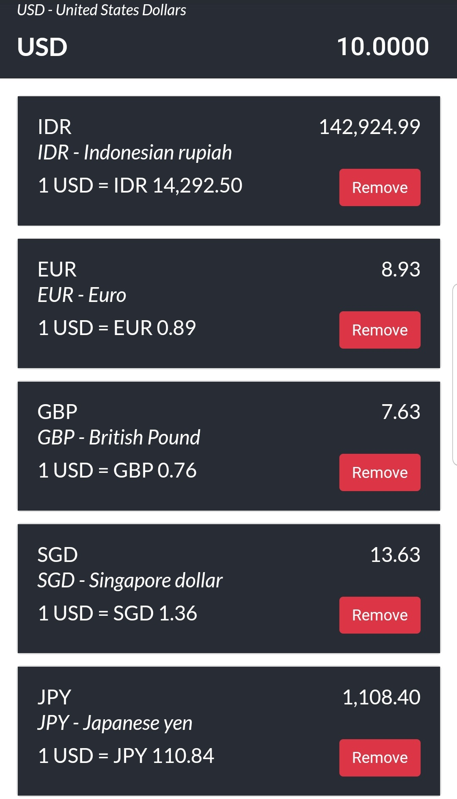

# Shopee Test - Currency Exchange App

This project was made with [React JS](https://reactjs.org/).

## Screenshot Preview
### Homepage view


### Adding new currency (JPY)


### Updated with JPY added


### Removed GBP from the list


## Used Library
- Bootstrap CDN (CSS classes and rules)
- Numeric (decimal and thousand divider places)
- Fetch (getting API)
- Dropdown (show more available currencies)

### Project File Structure

- List Components
    - Add Currency (Add currency)
    - Amount Field
    - List Currency
- Numeral Function
- Currency Name
- Main App Component (JS, CSS)

# How to Start

## Using NPM
### Install Node Modules First
```
npm install
```
### Start Development Server
```
npm start
```
## Using Docker
```
docker build . -t currency-app
docker container run -it -p 3000:3000 currency-app:latest
```